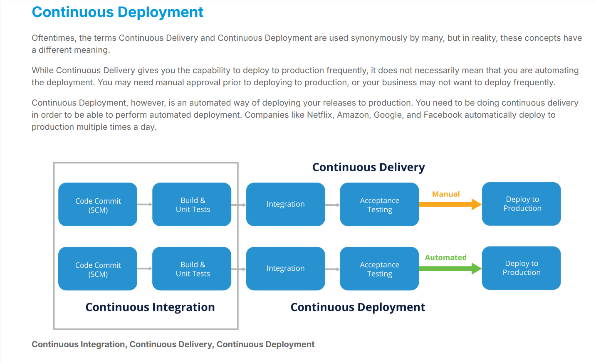
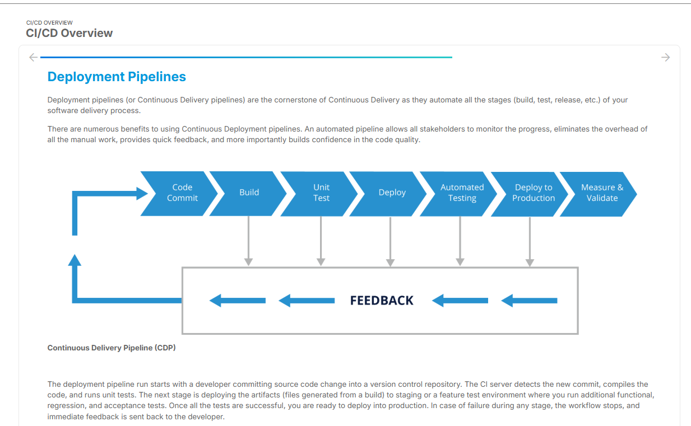
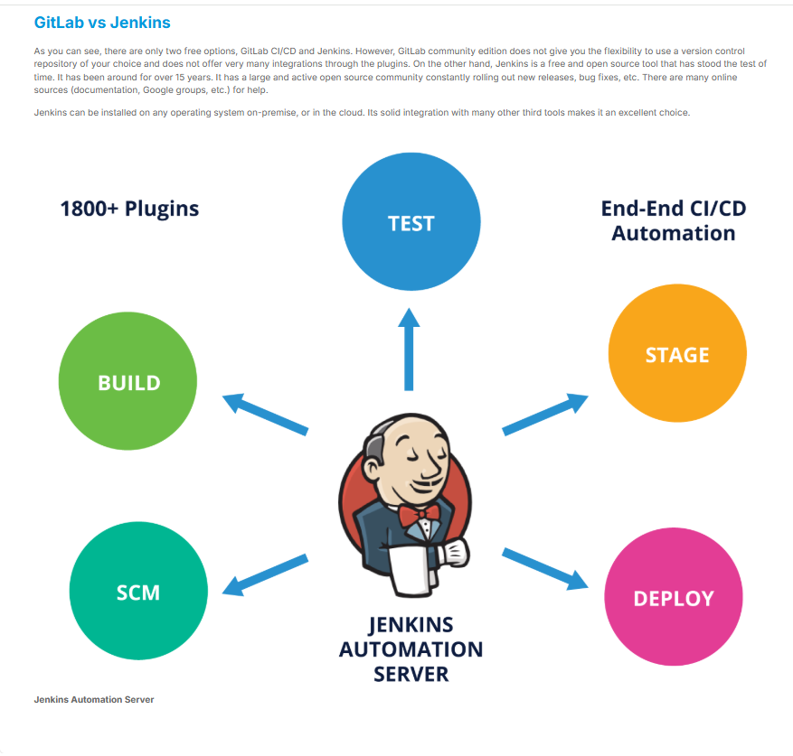

<!-- Tools for Deployment Pipeline
In order to automate the various stages of your deployment pipeline, you will need multiple tools. For example:

A version control system such as Git to store your source code.
A Continuous Integration (CI) tool such as Jenkins to run automated builds.
Test frameworks such as xUnit, Selenium, etc., to run various test suites.
A binary repository such as Artifactory to store build artifacts.
Configuration management tools such as Ansible.
A single dashboard to make the progress visible to everyone.
Frequent feedback in the form of emails, or Slack notifications.
And that’s not all. You will also need a single tool that can bring all these tools together to achieve CI/CD goals, -->

